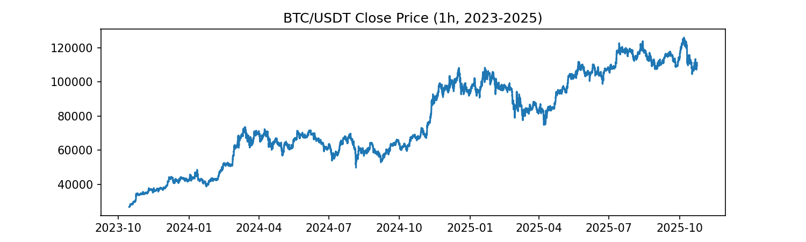

# Multi-Horizon BTC/USDT Forecasting with Deep Learning

A deep-learning time-series project that predicts **2-hour, 4-hour, and 6-hour cumulative BTC/USDT log returns** from recent 1-hour OHLCV history. The project compares **GRU, LSTM, TCN, and a lightweight Transformer encoder** under a shared preprocessing and evaluation pipeline.

<p align="center">
  
</p>

## Project overview

- **Data:** BTC/USDT 1-hour candles collected from the Binance public API
- **Period:** October 15, 2023 to October 15, 2025
- **Context window:** 240 hours (10 days)
- **Targets:** cumulative future log return over 2h, 4h, and 6h
- **Models:** GRU, LSTM, TCN, Transformer encoder
- **Training:** Huber loss, Adam, gradient clipping, early stopping
- **Evaluation:** MAE, RMSE, direction accuracy, and a simple sign-based long/short diagnostic backtest

## Features

The refactored pipeline implements the feature set explicitly described in the final presentation:

- OHLCV: open, high, low, close, volume
- log return
- EMA(12), EMA(26)
- RSI(14)
- MACD and MACD signal
- ATR(14)
- hour-of-day sine/cosine
- day-of-week sine/cosine

## Repository structure

```text
btc-multihorizon-forecasting/
├── README.md
├── requirements.txt
├── data/
│   └── btc_2y_1h.csv
├── src/
│   ├── download_data.py
│   ├── preprocess.py
│   ├── models.py
│   ├── train.py
│   └── evaluate.py
├── notebooks/
│   └── original_experiment.ipynb
├── assets/
│   ├── btc_close.png
│   └── btc_volume.png
├── results/
│   ├── reported_test_metrics.csv
│   ├── reported_backtest_metrics.csv
│   └── README.md
├── docs/
│   ├── final_presentation.pdf
│   └── proposal.pdf
└── artifacts/
    └── checkpoints/
```

## Setup

```bash
python -m venv .venv
source .venv/bin/activate        # Windows: .venv\Scripts\activate
pip install -r requirements.txt
```

## Download the dataset again

A copy of the original dataset is included in `data/`. To reproduce the Binance download:

```bash
python src/download_data.py
```

The cleaned downloader trims the final API batch to the requested end date and regenerates the two EDA figures in `assets/`.

## Train

Train all four model families:

```bash
python src/train.py
```

Or train selected models:

```bash
python src/train.py --models gru lstm
```

Useful options:

```bash
python src/train.py --window 240 --batch-size 256 --epochs 25 --patience 6 --lr 1e-3
```

Generated checkpoints are written to `artifacts/checkpoints/`, while fresh test metrics, backtest metrics, and predictions are written to `results/`.

## Results

Fresh evaluation results are intentionally generated by rerunning the cleaned pipeline:

```bash
python src/train.py
```

The original course-presentation numbers are retained under `results/archive/` for provenance, but they are **not presented as validated results of this refactored code**.

## Refactor note

The original notebook and course slides are retained under `notebooks/` and `docs/` for provenance. The scripts under `src/` are a cleaned version intended for GitHub and reproducibility.

One important correction was made to the original target construction. The original notebook used a shifted rolling expression that, for longer horizons, could mix past returns into the 4h/6h labels even though those returns were already visible in the input window. The refactor removes that overlap and explicitly defines the target as

```text
y_k(t) = r(t+1) + r(t+2) + ... + r(t+k)
```

and aligns the 240-hour input window so that it ends at time `t`. It also implements the technical and cyclical features described in the final presentation. Because of this methodological correction, the archived presentation accuracies should not be cited as performance of the cleaned pipeline. Fresh results are saved separately when the scripts are rerun.

## Limitations

- Single asset (BTC/USDT)
- Price/volume-derived features only; no order book or news data
- Course backtest ignores fees, funding, and slippage
- No walk-forward retraining in the original experiment

## Course materials

- `docs/proposal.pdf`: initial project proposal
- `docs/final_presentation.pdf`: final presentation
- `notebooks/original_experiment.ipynb`: original experimental notebook with training outputs
